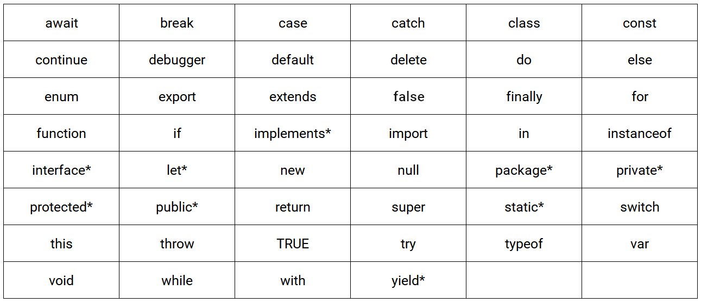

# 변수

변수는 왜 필요할까요? 크던 작던 애플리케이션은 데이터를 다룹니다.
결국 애플리케이션이라는 것은 데이터를 입력받고 출력하는 것이 전부이니까요.

**변수** 라는 것은 프로그래밍 언어에서 데이터를 관리하기 위한 핵심 개념입니다. 

예를 들어 볼게요.

```
10 + 20
```

위에 있는 식을 계산 해본다고 합시다. 10이라는 것도 알아야하고 20도 알아야하고 + 라는 연산자도 알고 있어야 합니다. 자바스크립트 엔진이 위의 식을 해석하면 이런 식으로 진행이 됩니다.
<br>
<br>
1. "+" 연산을 수행하기 위해 + 연산자의 좌변과 우변의 숫자값 기억 (피연산자)
2. 10 과 20을 메모리 상의 임의의 위치에 저장
3. cpu는 이 메모리에 저장된 값을 읽어 연산을 수행
4. 연산 결과 값도 메모리에 저장
<br>
<br>


이 연산에 문제점은 cpu가 만들어준 결과값을 재사용 할 수 없다는 것이다.
연산값을 재사용 하기 위해서는 직접 저장된 메모리 공간에 접근하는 방법밖에 없는데 이 방법은 치명적인 오류가 발생할 수 있습니다.
이렇기 때문에 변수를 사용하는 것이다.
<br>
<br>

**변수** 는 하나의 값을 저장하기 위해 확보한 메모리 공간 자체 또는 그 메모리 공간을 식별하기 위해 붙인 이름을 말한다.

```js
 var userId = 1;
 var userName = 'Lee';
```


그럼 이전에 연산했던 `10 + 20`을 변수를 사용하여 다시 해볼까요?

```js
var result = 10 + 20;
```
`10 + 20` 은 연산을 통해 30이라는 새로운 값으 생성하게 되는데 이 값은 result 라는 상징적인 이름이 붙어 메모리 공간에 저장이 되게 됩니다. 이렇게 되면 처음 변수를 몰랐을 때 10 + 20 을 시켰을 때 처럼 재사용이 불가능하거나 직접적으로 메모리 공간에 접근해야 될 이유가 사라지겠죠?

이런 이유로 변수를 사용하게 되는겁니다.

이런식으로 변수를 선언하고 값을 저장하는 것을 **할당** 이라고 부릅니다. 그리고 우리가 변수에 저장된 값을 읽어드리는 것을 **참조** 라고 해요.

자바스크립트에서는 사용자가 변수 이름을 사용해 참조를 요청하면 변수 이름과 매핑된 메모리 주소를 통해 메모리 공간에 접근하여 저장된 값을 반환해줍니다.

우리가 변수 이름을 정할 때, 이 변수에 저장된 값의 의미를 명확히 알 수 있는 이름으로 정하는 것이 코드의 가독성을 높일 수 있으니 이름을 많이 고려하여 변수를 선언해야 합니다!


**변수** 를 선언할 때 사용하는 키워드를 먼저 알아야 하는데요. 보통 그래도 자바스크립트를 나는 좀 했다! 라고 하시는분들은 알고 계실겁니다.

`var, let, const` 키워드를 사용하여 변수를 선언하는데요. `let, const`는 ES6 에서 도입된 키워드라 ES6 전에는 `var`가 유일한 변수 선언 키워드였어요.

이미 `var`가 있는데 `let const`가 왜 추가된걸까요... 하나만 사용하면 헷갈리지도 않고 참 좋을텐데 이 부분은 뒤에 가면 스코프를 배우게 되는데 그 부분을 배우고 나면 왜 `let const`가 추가됐는지 알 수 있을거에요.

```js
var score;
```

위 변수 선언문을 봐주세요 값을 할당하지 않고 선언만 `var`키워드를 사용하여 선언했습니다 그럼 이 값을 저장할 메모리 공간을 확보 했을텐데 저장한 값이 없으면 메모리 공간엔 무슨 값이 저장되어 있죠?

확보된 저장공간에는 자바스크립트 엔진에 의해 `undefined` 라는 값이 암묵적으로 할당되어 초기화 됩니다.
<br>
<br>

## 호이스팅 (Hoisting)

변수에 대해 공부하고 있으니, 꼭 짚고 나가야 하는 부분이겠죠 호이스팅 입니다. 

호이스팅이 뭘까요? 자바스크립트 공부하면서, 면접준비하면서 엄청 많이 들은 거같은데 정확한 개념이 뭘까요?

`호이스팅` 이란 코드가 실행되기 전에 변수선언/함수선언이 해당 스코프의 최상단으로 ****끌어 올려지는 것 같은 현상**** 입니다.
끌어올려지는 현상 이 아닌 "같은" 현상이에요.

자바스크립트 엔진은 코드를 실행하기 전 실행 가능한 코드를 형상화하고, 구분하는 과정을 거치는데. 자바스크립트 엔진은 이때 실행 컨텍스트를 위한 과정에서 모든 선언을 스코프에 등록 합니다.

지금 여기서는 변수 호이스팅만 생각해볼게요.
근데 여기서 분명 이렇게 한번쯤 들어봤던 분들이 계실거에요. `let,const` 는 호이스팅이 일어나지 않는다는데요?

아닙니다. 모든 선언은 호이스팅이 일어나요.
보기에 호이스팅이 발생하지 않는 것 처럼 동작할 뿐입니다.

`var`로 선언된 변수는 선언과 동시에 `undefined`로 초기화되어 메모리에 저장되는 것이구요
`let, const` 로 선언된 변수는 초기화 되지 않은 상태로 선언만 메모리에 저장됩니다.

`let, const`로 선언된 변수는 스코프 시작에서 변수의 선언까지 일시적 사각지대 (TDZ) 에 빠지기 때문에 호이스팅이 안일어나는 것 처럼 보일 뿐입니다. 이 키워드들은 초기화 단계와 선언단계가 분리되어서 진행되기 때문이에요. 스코프에 변수를 등록은 하지만, 초기화 단계는 변수 선언문에 도달 했을 때 이루어집니다.

호이스팅이 어느정도 이해가 되셨을까요? 꼭 알고 있어야 하는 부분이라 길게 설명해봤습니다.

변수에 값을 할당하는 것과 재할당 하는 것은 처음 우리가 자바스크립트를 배울 때 이미 반사적으로 배웠습니다.

```js
let user;
user = 'Hannah'
```

위 예제코드를 보시면 `let` 키워드를 사용하여 user 라는 변수를 선언한 뒤, `Hannah` 라는 값을 `user`에 할당해주었습니다.

만약 user 의 값을 변경하고 싶으시다면 똑같이 `user = "sumin"` 이런식으로 값을 재할당 한다면 `user`의 값은 `sumin` 으로 변경되어 있겠죠.

`var, let`은 값을 재할당 해줄 수 있지만 `const` 는 상수이기 때문에 값을 재할당 해줄수가 없어요 그래서 `const` 키워드를 사용할때는 변하지 않을 값을 변수로 선언할 때 사용합니다.

```js
var user; // undefined
user = 'hannah' // hannah
user = 'sumin' // sumin
```

위 코드에서 봤을 때, `var` 키워드를 사용해 `user` 라는 변수를 선언하고, 그 뒤 차례대로 두번의 할당, 재할당을 거쳤습니다.

맨 처음 `user`를 선언했을 때, 초기화를 진행하며 `undefined` 라는 값이 초기화 됐을거고 그 뒤로 차례대로 `hannah` , `sumin` 이 할당, 재할당을 거쳤습니다. 이 과정에서 이미 있던 메모리에 덮어 씌워지는게 아니라 메모리 공간에는 `undefined`, `hannah`가 식별자가 없는 상태로 남아있습니다.

그럼 `undefined` 와 `hannah`는 전혀 누구도 필요하지 않은 값이 되어있겠죠? 이런 불필요한 값들은 가비지 컬렉터에 의해 메모리 공간에서 제거됩니다. 
<br>
<br>

## 예약어와 네이밍 컨벤션
<br>
자바스크립트에는 이미 예약되어진 몇가지의 단어가 있는데 이 단어로는 변수 선언을 할 수 없습니다. 아래의 이미지에 있는 단어들을 예약어라고 불러요.
<br>
<br>




자바스크립트에서 보통 많이 사용하는 네이밍 컨벤션들이 있는데
1. 카멜 케이스
2. 파스칼 케이스
3. 스네이크 케이스

입니다.

```js
 let fristName // camel case
 let first_name // snake case
 let FirstName // pascal case
```
