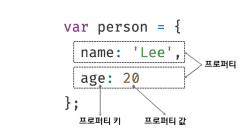
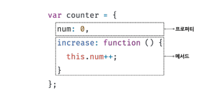

# 객체 리터럴

자바스크립트는 객체 기반 프로그래밍 언어입니다. 자바스크립트를 구성하는 거의 "모든 것"이 객체에요. 원시 값을 제외한 나머지 값은 모두 객체입니다.

원시 타입은 단 하나의 값만 나타내지만, 객체 타입은 다양한 타입의 값을 하나의 단위로 구성한 복합적인 자료구조입니다.

원시의 값, 즉 원시 값은 변경 불가능한 값이지만, 객체 타입의 값 즉 객체는 변경 가능한 값입니다.

객체는 0개 이상의 프로퍼티로 구성된 집합이며, 프로퍼티는 키와 값으로 구성됩니다.



자바스크립트에서 사용할 수 있는 모든 값은 프로퍼티 값이 될 수 있습니다.
따라서 함수도 프로퍼티 값으로 사용 할 수 있고, 프로퍼티 값이 함수일 경우, 일반 함수와 구분하기 위해 메서드라고 부릅니다.



이처럼 객체는 프로퍼티와 메서드로 구성된 집합체 입니다.

- 프로퍼티 : 객체의 상태를 나타내는 값
- 메서드 : 프로퍼티를 참조하고 조작할 수 있는 동작

이처럼 객체는 객체의 상태를 나타내는 값과 프로퍼티를 참조하고 조작할 수 있는 동작을 모두 포함할 수 있기 때문에 상태와 동작을 하나단위로 구조화할 수 있어 유용합니다.

#### 객체와 함수

> 자바스크립트의 객체는 함수와 밀접한 관계를 가집니다.<br>
> 함수로 객체를 생성하기도 하며 함수 자체가 객체이기도 합니다.
> 자바스크립트에서 함수와 객체는 분리해서 생각 할 수 없는 개념이에요. 즉, 객체를 이해해야 함수를 제대로 이해할 수 있고 반대로 함수를 이해해야 객체를 정확히 이해 할 수 있습니다.<br>

<br>

## 객체 리터럴에 의한 객체 생성

C++나 자바 같은 클래스 기반 객체지향 언어는 클래스를 사전에 정의하고 필요한 시점에 new 연산자와 함께 생성자를 호출하여 인스턴스를 생성하는 방식으로 객체를 생성합니다.

자바스크립트는 프로토타입 기반 객체지향 언어로서 클래스 기반 객체지향 언어와는 달리 다양한 객체 생성방법을 지원합니다.

- 객체 리터럴
- Object 생성자 함수
- 생성자 함수
- Object.create 메서드
- 클래스(ES6)

이러한 객체 생성방법 중에서 가장 일반적이고 간단한 방법은 객체 리터럴을 사용하는 방법입니다.

객체 리터럴은 중괄호({...}) 내에서 0개 이상의 프로퍼티를 정의합니다. 변수에 할당되는 시점에 자바스크립트 엔진은 객체 리터럴을 해석해 객체를 생성합니다.

```js
var person = {
  name: "hannah",
  sayHello: function () {
    console.log(`Hello! My name is ${this.name}.`);
  },
};

console.log(typeof person); // object
console.log(person); // {name: 'hannah', sayHello : f}
```

만약 중괄호 내에 프로퍼티를 정의하지 않으면 빈 객체가 생성됩니다.

```js
var empty = {};
console.log(typeof empty); // object
```

객체 리터럴의 중괄호는 코드 블럭을 의미하지 않습니다. 코드 블럭은 닫는 중괄호 뒤에서 세미콜론을 붙이지 않습니다, 하지만 객체 리터럴은 값으로 평가되는 **표현식** 입니다.

객체 리터럴은 자바스크립트의 유연함과 강력함을 대표하는 객체 생성 방식입니다. 객체를 생성하기 위해 클래스를 먼저 정의하고 new 연산자와 함께 생성자를 호출할 필요가 없습니다. 숫자 값이나 문자열을 만드는 것과 유사하게 리터럴로 객체를 생성합니다.

객체 리터럴에 프로퍼티를 포함시켜 객체를 생성함과 동시에 프로퍼티를 만들 수도 있고, 객체를 생성한 이후에 프로퍼티를 동적으로 추가할 수도 있습니다.

## 프로퍼티

객체는 프로퍼티의 집합이며, 프로퍼티는 키와 값으로 구성됩니다.

```js
 var person {
    // 프로퍼티 키는 name, 프로퍼티 값은 'Hannah'
    name : 'Hannah',
    age : 30
 }
```

프로퍼티를 나열할 때는 쉼표로 구분합니다. 인반적으로 마지막 프로퍼티 뒤에는 쉼표를 사용하지 않으나 사용해도 좋습니다. (ESLint, Prettier를 사용하면 save를 눌렀을 때 자동으로 쉼표가 추가되기도 합니다)

프로퍼티 키와 프로퍼티 값으로 사용할 수 있는 값은 다음과 같습니다.

- 프로퍼티 키 : 빈 문자열을 포함하는 모든 문자열 또는 심벌 값
- 프로퍼티 값 : 자바스크립트에서 사용할 수 있는 모든 값

프로퍼티 키는 프로퍼티 값에 접근할 수 있는 이름으로서 식별자 역할을 합니다. 하지만 반드시 식별자 네이밍규칙을 따라야 하는 것은 아닙니다.

단, 식별자 네이밍 규칙을 준수하는 프로퍼티 키와 그렇지 않은 프로퍼티키는 미묘한 차이가 있습니다.

심벌 값도 프로퍼티 키로 사용할 수 있지만, 일반적으로 문자열을 사용합니다. 이 때, 프로퍼티 키는 문자열이므로 따옴표('...' 또는 "...") 로 묶어야 합니다. 하지만 식별자 네이밍 규칙을 준수하는 이름, 즉 자바스크립트에서 사용 가능한 유효한 이름인 경우 따옴표를 생략 할 수 있습니다. 반대로 말하면 **식별자 네이밍 규칙을 따르지 않는 이름에는 반드시 따옴표를 사용해야 합니다**

식별자 네이밍 규칙을 따르지 않는 프로퍼티 키를 사용하면 번거로운 일이 발생하는데, 따라서 가급적 식별자 네이밍 규칙을 준수하는 프로퍼티 키를 사용할 것을 권장합니다.

```js
 var person {
   firstName : 'Hannah', // 식별자 네이밍 규칙을 준수하는 프로퍼티 키
   'last-name' : 'Jeong'  // 식별자 네이밍 규칙을 준수하지 않은 프로퍼티 키
 }

 console.log(person) // {firstName : 'Hananh', last-name : "Jeong"}
```

프로퍼티 키로 사용한 `firstName`은 식별자 네이밍 규칙을 준수하기 때문에 따옴표를 생략할 수 있지만, `last-name`인 경우 식별자 네이밍 규칙을 준수하지 않기 때문에 따옴표를 생략할 수 없습니다. 자바스크립트 엔진은 만약 `last-name`의 따옴표를 생략한다면 `last-name` 안에 - 을 연산자가 있는 표현식으로 해석해버립니다.

그래서 생략해버린다면, `last-name`에서 `SyntaxError : Unexpected token -` 가 발생합니다.

문자열 또는 문자열로 평가할 수 있는 표현식을 사용해 프로퍼티 키를 동적으로 생성할 수도 있는데, 이 경우에는 프로퍼티 키로 사용할 표현식을 대괄호([...])로 묶어줘야 합니다.

```js
var obj = [];
var key = "hello";

obj[key] = "World";
// var obj = { [key] : 'World'};

console.log(obj); // {hello : 'World'};
```

빈 문자열을 프로퍼티 키로 사용해도 에러가 발생하지 않습니다, 하지만 키로서의 의미를 갖지 못하므로 권장하진 않습니다.

```js
var foo = {
  "": "", // 빈 문자열도 프로퍼티 키로 사용할 수 있습니다.
};

console.log(foo); // {'' : ''}
```

프로퍼티 키에 문자열이나 심벌 값 외의 값을 사용하면 암묵적 타입 변환을 통해 문자열이 됩니다. 프로퍼티 키로 숫자 리터럴을 사용하게 되면 따옴표는 붙지 않지만, 내부적으로는 문자열로 반환됩니다.

var, function과 같은 예약어를 프로퍼티 키로 사용해도 에러가 발생하지는 않지만 예상치 못한 에러가 발생할 여지가 있으므로 권장하지는 않습니다.

그리고, 이미 존재하는 프로퍼티 키를 중복 선언하면 나중에 선언한 프로퍼티가 먼저 선언한 프로퍼티를 덮어 씌워버리기 때문에 이 때, 에러가 발생하지 않는 다는 점에 주의합시다.

## 메서드

자바스크립트에서 사용할 수 있는 모든 값은 프로퍼티 값으로 사용할 수 있다고 말씀드렸습니다, 아직 살펴보지 않았지만 자바스크립트 함수는 객체입니다. 따라서 함수는 값으로 취급할 수 있기 때문에 프로퍼티 값으로 사용할 수 있습니다.

프로퍼티 값이 함수일 경우 일반 함수와 구분하기 위해 메서드라고 부릅니다. 즉, 메서드는 객체에 묶여 있는 함수를 의미합니다.

```js
var circle = {
  radius: 5,
  getDiameter: function () {
    return 2 * this.radius; // this는 circle을 가르킵니다.
  },
};

console.log(circle.getDiameter()); // 10
```

## 프로퍼티 접근

프로퍼티에 접근하는 방법은 두가지가 있습니다.

- 마침표 프로퍼티 접근 연산자(.) 를 사용하는 마침표 표기법
- 대괄호 프로퍼티 접근 연산자([...])를 사용하는 대괄호 표기법

프로퍼티 키가 식별자 네이밍 규칙을 준수하는 이름, 즉 자바스크립트에서 사용 가능한 유효한 이름이면 마침표 표기법과 대괄호 표기법을 모두 사용할 수 있습니다.

마침표 프로퍼티 접근 연산자 또는 대괄호 프로퍼티 접근 연산자의 좌측에는 객체로 평가되는 표현식을 기술합니다.

마침표 프로퍼티 접근 연산자의 우측 또는 대괄호 프로퍼티 접근 연산자의 내부에는 프로퍼티 키를 지정합니다.

```js
 var person {
   name : 'Hannah',
 }

 console.log(person.name) // 'Hannah'
 console.log(person['name']) // 'Hannah'
 console.log(person[name]) // ReferenceError : name is not defined
 console.log(person.age) // undefined
```

대괄호 표기법을 사용하는 경우 **대괄호 프로퍼티 접근 연산자 내부에 지정하는 프로퍼티 키는 반드시 따옴표로 감싼 문자열**이어야 합니다. 감싸지 않은 이름을 프로퍼티 키로 사용하면 자바스크립트
엔진은 식별자로 해석해버립니다.

객체에 존재하지 않는 프로퍼티에 접근하면 undefined를 반환하고, 이때는 ReferenceError가 발생하지 않습니다.

프로퍼티 키가 식별자 네이밍 규칙을 준수하지 않은 이름이라면 반드시 대괄호 표기법을 사용해야합니다, 단 프로퍼티 키가 숫자로 이뤄진 문자열일 경우 따옴표를 생략할 수 있습니다. 그 외의 경우 대괄호 내에 들어가는 프로퍼티 키는 반드시 따옴표로 감싼 문자열이여야 합니다.

```js
 var person = {
    'last-name' : 'Jeong'
    1 : 10
 }

 person.'last-name' // SyntaxError : Unexpected string
 person.last-name // 브라우저 환경 NaN
                  // Node.js 환경 ReferenceError : name is not defined

person.[last-name] // ReferenceError : last is not defined
person['last-name'] // Jeong

person.1 // SyntaxError : Unexpected number
person.'1' // SyntaxError : Unexpected string
person.[1] // -> 10 person[1] -> person['1']
person['1'] // 10
```

위 예제에서 `person.last-name` 의 실행 결과는 Node.js와 브라우저 환경에서 다른 결과가 나오게 됩니다. 왜 일까요?

`person.last-name`을 실행할 때, 자바스크립트 엔진은 먼저 `person.last`를 병가하고 `person` 객체는 `last`라는 프로퍼티 키를 가진 프로퍼티 값이 없기 때문에 `person.last`는 `undefined`로 평가 됩니다. 따라서 `person.last-name`은 `undefined - name` 과 같기 때문에 자바스크립트 엔진은 `name`이라는 식별자를 찾습니다. `undefined - name`은 `NaN` 이기 때문에 브라우저 환경에서는 name이라는 전역 변수가 암묵적으로 존재하기 때문에 `NaN` 이라는 결과값을 갖게 됩니다.

Node.js 환경에서는 현재 어디에도 `name` 이라는 식별자 선언이 없으므로 `ReferenceError : name is not defined`라는 에러가 발생합니다.

## 프로퍼티 값 갱신

이미 존재하는 프로퍼티에 값을 할당해주면 프로퍼티 값이 갱신됩니다.

```js
var person {
    name : 'Hannah'
}

person.name = 'Sumin';

consol.log(person.name) // 'Sumin'
```

## 프로퍼티 동적 생성

존재하지 않는 프로퍼티에 값을 할당하면 프로퍼티가 동적으로 생성되어 추가되고 프로퍼티 값이 할당됩니다.

```js
 var person {
    firstName : 'Hannah',
 }

 person.lastName = 'Jeong'

 console.log(person) // {firstName : 'Hannah', lastName : 'Jeong'}
```

## 프로퍼티 삭제

delete 연산자는 객체의 프로퍼티를 삭제합니다. 이때 delete 연산자의 피연산자는 프로퍼티 값에 접근할 수 있는 표현식이여야 합니다. 만약 존재하지 않는 프로퍼티를 삭제하면 아무런 에러 없이 무시됩니다.

```js
 var person {
    firstName : 'Hannah',
 }

 person.lastName = 'Jeong',

 delete person.lastName;

 delete person.address // 무시됨

 console.log(person) // {firstName : 'Hannah'}
```

## ES6에서 추가된 객체 리터럴의 확장 기능

ES6에서는 더욱 간편하고 표현력 있는 객체 리터럴의 확장 기능을 제공하고 있습니다.

### 프로퍼티 축약 표현

객체 리터럴의 프로퍼티는 프로퍼티 키와 프로퍼티 값으로 구성되는데, 프로퍼티 값은 변수에 할당된 값, 즉 식별자 표현식일 수도 있습니다.

```js
//es5

var x = 1,
  y = 2;

var obj = {
  x: x,
  y: y,
};

console.log(obj); // {x : 1, y: 2};
```

ES6에서는 프로퍼티 값으로 변수를 사용하는 경우 변수 이름과 프로퍼티 키가 동일한 이름일 때 프로퍼티 키를 생략할 수 있습니다. 이 때 프로퍼티 키는 변수 이름으로 자동 생성됩니다.

```js
//ES6

let x = 1,
  y = 2;

const obj = { x, y };
console.log(obj); // {x : 1, y : 2}
```

### 계산된 프로퍼티 이름

문자열 또는 문자열로 타입 변환할 수 있는 값으로 평가되는 표현식을 사용해 프로퍼티 키를 동적으로 생성할 수 있습니다.
단 프로퍼티 키로 사용할 표현식을 대괄호([...])로 묶어야 합니다.

ES5 에서 계산된 프로퍼티 이름으로 프로퍼티 키를 동적 생성하려면 객체 리터럴 외부에서 대괄호([...]) 표기법을 사용해야 합니다.

```js
var prefix = "prop";
var i = 0;

var obj = {};

obj[prefix + "-" + ++i] = i;
obj[prefix + "-" + ++i] = i;
obj[prefix + "-" + ++i] = i;

console.log(obj); // {prop-1 : 1, prop-2 : 2, prop-3 : 3}
```

ES6에서는 객체 리터럴 내부에서도 계산된 프로퍼티 이름으로 프로퍼티 키를 동적 생성할 수 있습니다.

```js
//ES6
const prefix = "prop";
let i = 0;

const obj = {
  [`${prefix}-${++i}`]: i,
  [`${prefix}-${++i}`]: i,
  [`${prefix}-${++i}`]: i,
};

console.log(obj); // {prop-1 : 1, prop-2 : 2, prop-3 : 3}
```

### 메서드 축약 표현

ES5에서 메서드를 정의하려면 프로퍼티 값으로 함수를 할당합니다.

```js
var obj = {
  name: "Hannah",
  sayHi: function () {
    console.log("Hi!" + this.name);
  },
};

obj.sayHi(); // Hi! Hannah
```

ES6 에서는 메서드를 정의할 때, function 키워드를 생략한 축약 표현을 사용할 수 있습니다.

```js
//ES6

const obj = {
  name: "Hannah",
  sayHi() {
    console.log("Hi!" + this.name);
  },
};
obj.sayHi(); // Hi! Hannah
```
