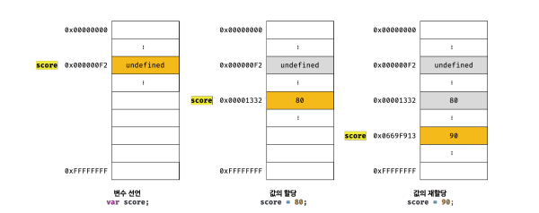
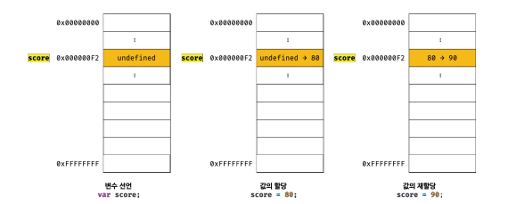
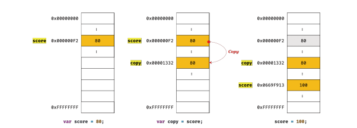
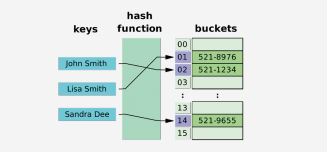
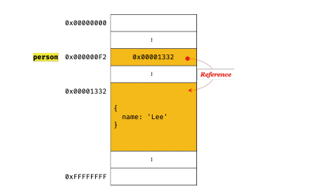

# 원시 값과 객체의 비교

이전 데이터 타입에서 살펴 봤다 싶이, 자바스크립트에는 원시타입과 객체 타입으로 구분 할 수 있습니다. 객체 타입과 원시 타입은 근본적으로 다른데, 3가지 측면에서 다르다고 볼 수 있습니다.

1. 원시 타입의 값, 즉 원시 값은 변경 불가능한 값 입니다. 하지만 객체 타입의 값, 즉 객체는 변경 가능한 값 입니다.
2. 원시 값을 변수에 할당하면 변수에는 실제 값이 저장됩니다. 하지만 객체를 변수에 할당하면 변수에는 참조 값이 저장됩니다.
3. 원시 값을 갖는 변수를 다른 변수에 할당하면 **원본의 원시 값이 복사되어 전달되는 값에 의한 전달**이 일어나고, 객체를 가리키는 변수에 다른 변수를 할당하면 **원본의 참조 값이 복사되어 전달되는 참조에 의한 전달**이 발생한다.

## 원시 값

### 변경 불가능한 값

원시 타입의 값, 즉 원시 값은 변경 불가능한 값입니다. 한번 생성된 원시 값은 읽지 전용 값으로서, 변경할 수 없습니다.

**변경 불가능하다는 것은 변수가 아니라 값에 대한 진술** 입니다.
"원시 값은 변경 불가능하다" 라는 말은 원시 값 자체를 변경할 수 없다는 것이지 변수 값을 변경할 수 없다는 것이 아닙니다.
변수는 언제든지 재할당을 통해 변수 값을 변경할 수 있습니다.

변수의 상대 개념인 상수는 재할당이 금지된 변수입니다. 상수도 값을 저장하기 위한 메모리 공간이 필요하므로 변수라고 할 수 있습니다, 단 상수는 단 한 번만 할당이 허용되므로 변수 값을 변경 할 수 없습니다.

원시 값은 변경 불가능한 값, 즉 읽기 전용 값이고 원시 값은 어떤 일이 있어도 불변합니다. 이러한 원시 값의 특성은 데이터의 신뢰성을 보장해 줍니다.

원시 값을 할당한 변수에 새로운 원시 값을 재할당하면 메모리 공간에 저장되어 있는 재할당 이전의 원시 값을 변경하는 것이 아닌 새로운 메모리 공간을 확보하고 재할당한 원시 값을 저장한 후, 변수를 새롭게 재할당한 원시 값을 가리키게 되는데, 이 때 변수가 참조하던 메모리 공간의 주소가 바뀝니다.



변수가 참조하던 메모리 공간의 주소가 변경된 이유는 변수에 할당된 원시 값이 변경 불가능한 값이기 때문인데, 만약 원시 값이 변경 가능한 값이라면 변수에 새로운 원시 값을 재할당했을 때, 변수가 가리키던 메모리 공간의 주소를 바꿀 필요 없이 원시 값 자체를 변경하면 그만입니다. 그럼 변수가 참조하던 메모리 공간의 주소가 바뀌지 않겠죠.



하지만 원시 값은 변경 불가능한 값이기 때문에 값을 직접 변경할 수 없습니다. 따라서 변수 값을 변경하기 위해 원시 값을 재할당하면 새로운 메모리 공간을 확보하고 재할당한 값을 저장한 후, 변수가 참조하던 메모리 공간의 주소를 변경해주는데 이러한 특성을 **불변성** 이라고 합니다.

**불변성을 갖는 원시 값을 할당한 변수는 재할당 이외의 변수 값을 변경할 수 있는 방법이 없습니다**

### 문자열과 불변성

원시 값을 저장하려면 먼저 확보해야 하는 메모리 공간을 결정해주어야 하는데, 이를 위해 원시 타입별로 메모리 공간의 크기가 미리 정해져 있습니다. ECMAScript 사양에 문자열 타입(2byte), 숫자 타입(8byte) 이오의 원시 타입은 크기를 명확히 규정하고 있지 않아 브라우저 제조사의 구현에 따라 원시 타입의 크기는 다를 수도 있습니다.

원시 값인 문자열은 다른 원시 값과 비교할 때 독특한 특징이 있는데, 문자열은 0개 이상의 문자로 이뤄진 집합을 말하며, 1개의 문자는 2byte의 메모리 공간에 저장됩니다. 따라서 문자열은 몇 개의 문자로 이뤄졌느냐에 따라 필요한 메모리 공간의 크기가 결정되고, 숫자 값은 1도, 1000000도 동일한 8byte가 필요하지만 문자열의 경우는 예를 들자면, 1개의 문자로 이루어진 문자열은 2byte, 10개의 문자열로 이루어진 문자열은 20byte가 필요합니다.

자바스크립트의 문자열은 원시 타입이고, 변경이 불가능합니다

```js
var str = "Hello";
str = "World";
```

위의 코드를 보면서 설명을 드릴게요. 자바스크립트 코드가 실행되면, 첫번째 문자열 `Hello`가 생성되고, 식별자 `str`은 문자열 `Hello`가 저장된 메모리 공간의 첫 번째 메모리 셀 주소를 가르키게 됩니다. 그리고 두번째 문이 실행되면 새로운 문자열 `World`를 메모리에 생성하고 식별자 `str`은 이걸 가리킵니다. 그렇다고 `Hello`가 메모리 상에서 삭제되는건 아니고, `Hello`와 `World`는 모두 메모리에 존재합니다. 식별자 `str`는 문자열 `Hello` 를 가리키다가 문자열 `world`를 가리키도록 변경되었을 뿐입니다.

문자열은 유사 배열 객체이면서 이터러블이므로 배열과 유사하게 각 문자에 접근할 수 있습니다.

#### 유사 배열 객체

유사배열 객체란 마치 배열처럼 인덱스로 프로퍼티 값에 접근할 수 있고 length 프로퍼티를 갖는 객체를 말합니다. 문자열은 마치 배열처럼 인덱스를 통해 각 문자에 접근 할 수 있고, length 프로퍼티를 갖기 때문에 유사 배열 객체이고 for문으로 순회 할 수도 있습니다.

```js
var str = "string";
console.log(str[0]); // s

console.log(str.length); // 6
cosnole.log(str.toUpperCase()); // STRING
```

그럼 문자열의 한 문자를 변경해볼까요?

```js
var str = "string";
str[0] = "S";

console.log(str); // string
```

`str[0] = 'S'` 처럼 이미 생성된 문자열의 일부 문자를 변경해도 반영되지 않습니다. 문자열은 변경 불가능한 불변성을 가지고 있어요. 이렇기 때문에 데이터의 신뢰성을 보장합니다. 변수에 새로운 문자를 재할당 하는건 가능하지만 일부 문자를 변경하기는 어렵습니다.

### 값에 의한 전달

```js
var score = 80;
var copy = score;

console.log(score); // 80
console.log(copy); // 80

score = 100;

console.log(score); // 100
console.log(copy); // ?
```

위의 코드를 보시면 score 변수에 숫자 80을 할당했습니다. 그리고 copy 에 score를 할당해줬으니 현재 4번째 문까지는 score의 값과 copy 의 값은 80으로 동일합니다. 그 이후 score에 100이라는 값을 재할당 해주었습니다. 그럼 score의 값은 100으로 바뀌었을거고 copy의 값은 어떻게 되었을까요? 동일하게 80 입니다.

이 질문의 핵심은 "변수에 변수를 할당했을 때 무엇이 어떻게 전달되는가" 입니다. `copy = score` 에서 score는 변수에 변수 값 80이 평가되므로 copy에도 80이 할당됐을겁니다. 이 때 새로운 숫자 값 80이 생성되어 copy 변수에 할당됩니다.

이처럼 변수에 원시 값을 갖는 변수를 할당하면 할당받는 변수에는 할당되는 변수의 원시 값이 복사되어 전달됩니다.

이를 **값에 의한 전달**이라 합니다. score를 바라보는게 아니라, score의 값인 80인 숫자값이 복사되어 새로 생성되어 copy에 할당되는겁니다. **score 의 80과 copy 80은 다른 메모리 공간에 저장된 별개의 값입니다**

이렇기 때문에 score 변수의 값을 변경해도 copy 변수의 값에는 어떠한 영향을 주지 않습니다.



"값에 의한 전달"이라는 용어는 자바스크립트를 위한 용어가 아니므로 사실 오해가 있을수도 있습니다. **엄격하게 표현하면 변수에는 값이 전달되는 것이 아니라 메모리 주소가 전달되기 때문에 이는 변수와 같은 식별자는 값이 아니라 메모리 주소를 기억하고 있기 때문**

식별자로 값을 구별해서 식별한다는 것은 식별자가 기억하고 있는 메모리 주소를 통해 메모리 공간에 저장된 값을 접근할 수 있다는 것을 의미합니다. 즉 식별자는 메모리 주소에 붙인 이름이라고 할 수 있습니다.

```js
var x = 10;
```

위 예제를 봤을 때, 할당 연산자는 숫자 리터럴 10에 의해 생성된 숫자 값 10이 저장된 메모리 공간의 주소를 전달합니다.
식별자 x는 메모리 공간에 저장된 숫자 값 10을 식별할 수 있습니다.

`var copy = score`

위 예제의 경우 score는 식별자 표현식으로서 숫자 값 80으로 평가됩니다. 이 때 두가지 평가 방식이 가능합니다.

1. 새로운 80을 생성해서 메모리 주소를 전달하는 방식, 이 방식은 할당 시점에 두 변수가 기억하는 메모리 주소가 다릅니다.

2. score 의 변수값 80의 메모리 주소를 그대로 전달하는 방식. 이 방식은 할당 시점에 두 변수가 기억하는 메모리 주소가 같다.

**이처럼 "값에 의한 전달"도 사실은 값을 전달하는 것이 아니라 메모리 주소를 전달합니다. 단, 전달된 메모리 주소를 통해 메모리 공간에 접근하면 값을 참조할 수 있습니다.**

중요한 것은 변수에 원시 값을 갖는 변수를 할당하면 변수 할당 시점이든, 두 변수 중 어느 하나의 변수에 값을 재할당하는 시점이든 결국 두 변수의 원시 값은 서로 다른 메모리 공간에 저장된 별개의 값이 되어 어느 한쪽에서 재할당을 통해 값을 변경하더라도 서로 간섭할 수 없습니다.

## 객체

객체는 프로퍼티의 개수가 정해져 있지 않고 동적으로 추가되고 삯제될 수 있습니다. 그리고 프로퍼티의 값에 대한 제약도 없어요.
따라서 객체는 원시 값과 같이 확보해야 할 메모리 공간의 크기를 사전에 정해 둘 수 없습니다.

객체는 복합적인 자료구조이므로 객체를 관리하는 방식이 원시 값과 비교해서 복잡하고 구현 방식도 브라우저 제조사마다 다를 수 있습니다.

원시값은 객체에 비해 상대적으로 적은 메모리를 소비하지만 객체는 경우에 따라 크기가 매우 클 수도 있습니다. 따라서 객체는 원시 값과 다른 방식으로 동작하도록 설계되어 있습니다.

#### 자바스크립트 객체의 관리 방식

자바스크립트 객체는 프로퍼티 키를 인덱스로 사용하는 해시 테이블 이라고 생각할 수 있습니다. 대부분의 자바스크립트 엔진은 해시 테이블과 유사하지만 높은 성능을 위해 일반적인 해시 테이블보다 나은 방법으로 객체를 구현합니다.



자바, C++ 같은 클래스 기반 객체지향 프로그래밍 언어는 사전에 정의된 클래스를 기반으로 객체를 생성하는데, 객체를 생성하기 이전에 이미 프로퍼티와 메서드가 정해져 있고 객체가 생성된 이후에는 프로퍼티를 삭제하거나 추가할 수 없습니다.

하지만 자바스크립트는 클래스 없이 객체를 생성할 수 있으며 객체가 생성된 이후라도 동적으로 프로퍼티와 메서드를 추가 할 수 있습니다. 사용하기에는 매우 편리하지만 성능 면에서 클래스 기반 객체지향 프로그래밍 언어보다 비용이 더 많이 드는 비효율적 방식이라 V8 자바스크립트 엔진에서는 프로퍼티에 접근하기 위해 동적 탐색 대신에 히든 클래스라는 방식을 사용합니다. 히든 클래스는 자바와 같이 고정된 객체 레이아웃과 유사하게 동작합니다.

### 변경 가능한 값

객체 타입의 값, 즉 객체는 변경 가능한 값 입니다.

```js
var person = {
  name: "Hannah",
};
```

객체를 할당한 변수가 기억하는 메모리 주소를 통해 메모리 공간에 접근하면 참조 값에 접근할 수 있습니다. 참조 값은 생성된 객체가 저장된 메모리 공간의 주소 그 자체입니다.



객체를 할당한 변수를 참조하면 메모리에 저장되어 있는 참조 값을 통해 실제 객체에 접근합니다.

```js
var person = {
  name: "Hannah",
};

console.log(person); // {name : 'Hannah'}
```

객체를 할당한 변수의 경우 "변수는 객체를 참조하고 있다" 또는 "변수는 객체를 가리키고 있다" 라고 표현 합니다.

**원시 값은 변경 불가능한 값이므로 원시 값을 갖는 변수의 값을 변경하려면 재할당 외에 방법이 없습니다. 하지만 객체는 변경 가능한 값입니다. 객체를 할당한 변수는 재할당 없이 객체를 직접 변경할 수 있습니다.**

```js
var person = {
  name: "Hannah",
};

person.name = "Sumin";
person.address = "Seoul";

console.log(person); // {name : 'Sumin', address : 'Seoul'};
```

객체를 생성하고 관리하는 방식은 매우 복잡하고 비용도 많이 드는 일입니다. 객체를 변경할 때마다 원시 값처럼 이전 값을 복사해서 새롭게 생성한다면 명확하고 신뢰성이 확보되겠지만, 객체는 크기가 매우 클 수도 있고, 원시 값처럼 크기가 일정하지도 않으며, 프로퍼티 값이 객체일 수도 있어서 복사해서 생성하는 비용이 많이 듭니다.

다시 말해, 메모리의 효율적인 소비가 어렵고 성능이 나빠진다고 볼 수 있겠죠?

따라서 메모리를 효율적으로 사용하기 위해, 그리고 객체를 복사해 생성하는 비용을 절약하여 성능을 향상시키기 위해 객체는 변경 가능한 값으로 설계되어 있습니다.

원시 값과는 다르게 여러 개의 식별자가 하나의 객체를 공유 할 수 있다는 부작용도 가지고 있습니다.

#### 얕은 복사 & 깊은 복사

객체를 프로퍼티 값으로 갖는 객체의 경우 얕은 복사는 한 단계까지만 복사하는 것을 말하고, 깊은 복사는 객체에 중첩되어 있는 객체까지 모두 복사하는 것을 말합니다.

**얕은 복사** <br>
<br>
얕은 복사는 참조값의 복사를 나타내는데,

```js
const obj = { a: 1 };
const copyObj = obj;

copyObj.a = 2;

console.log(obj.a); // 2;
console.log(copyObj === obj); // true;
```

위의 코드를 보시면 `obj`라는 객체를 `copyObj`라는 객체에 복사하여 `copyObj.a`의 값을 변경하였더니 `obj.a`의 값도 변경되었습니다. 얕은 복사는 데이터가 그대로 생성되는 것이 아닌 해당 데이터의 참조 값을 전달하여 한 데이터를 공유하고 있는 것입니다.

`copyObj`와 `obj`는 하나의 객체를 바라보고 있습니다.

**깊은 복사**
<br>
<br>

객체를 그대로 복사하여 사용하면 기존 객체의 데이터가 변경될 수 있기 때문에 깊은 복사를 사용하는 것이 좋습니다. 객체의 깊은 복사를 하는 방법으로는 라이브러리를 사용하는 방법과 JSON.parse(JSON.stringify(obj)) 를 사용하는 방법, 그리고 structuredClone 을 사용하는 방법이 있습니다.

아래의 예시코드에서는 structuredClone을 사용하여 깊은 복사를 진행합니다. structedClone은 Node 17 이상에서만 지원한다는 점만 조심하면 됩니다.

```js
const obj = {
  a: 1,
  b: { c: 2 },
};

const copyObj = structuredClone(obj);

copyObj.b.c = 5;

console.log(obj);
/*
{
  "a": 1,
  "b": {
    "c": 2
  }
}
*/

console.log(copyObj);
/*
{
  "a": 1,
  "b": {
    "c": 5
  }
}
*/
```

### 참조에 의한 전달

여러 개의 식별자가 하나의 객체를 공유할 수 잇다는 것이 무엇을 의미하고 어떤 부작용이 발생하는지 확인해 봅시다.

```js
var person = {
  name: "Hannah",
};

var copy = person;
```

객체를 가리키는 변수를 다른 변수에 할당하면 참조 값이 복사되어 전달됩니다. 이를 **참조에 의한 전달** 이라고 하는데,

이렇게 되면 두 개의 식별자가 하나의 객체를 공유하게 됩니다. 식별자는 메모리 주소를 기억하고 있고 `person`과 `copy`는 현재 같은 객체를 바라보고 있어요. 이 상태에서 만약 `copy`에 새로운 값을 추가하거나 변경하게 되면 `person`이 바라보고 있는 객체에서도 값이 변경되게 됩니다.

결국 "값에 의한 전달"과 "참조에 의한 전달"은 식별자가 기억하고 있는 메모리 공간에 저장되어 있는 값을 복사해서 전달한다는 면에서는 동일합니다. 다만 식별자가 기억하고 있는 메모리 공간, 즉 변수에 저장되어 있는 값이 원시 값이냐 참조 값이냐만의 차이만 있습니다.

따라서 자바스크립트에서는 "참조에 의한 전달"은 존재하지 않고 "값에 의한 전달" 만이 존재한다고 말할 수 있습니다.
