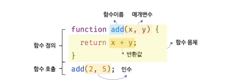
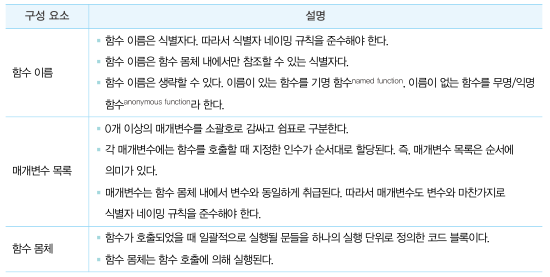
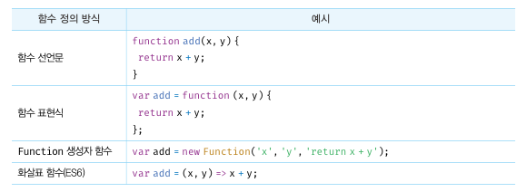

# 함수

함수는 자바스크립트에서 가장 중요한 핵심 개념입니다.
뒷 부분에서 공부할 `스코프, 실행 컨텍스트, 클로저, 생성자 함수에 의한 객체 생성, this, 프로토타입, 모듈화` 등이 모두 함수와 깊은 관련이 있습니다.

수학에서의 함수는 입력을 받아 출력을 내보내는 일련의 과정을 정의한 것입니다. 프로그래밍 언어의 함수도 수학 함수와 같은 개념입니다. 예를 들어, `f(x,y) = x + y` 라는 함수를 자바스크립트 함수로 표현해보겠습니다.

```js
function add(x, y) {
  return x + y;
}

add(3, 5); // 8
```

프로그래밍 언어의 함수는 **일련의 과정을 문으로 구현하고 코드 블럭으로 감싸서 하나의 실행 단위로 정의한 것** 입니다.



여기서 보이다 싶이, 함수 내부로 입력을 전달받는 변수를 `매개변수`, 입력을 `인수`, 출력을 `반환값` 이라고 합니다. 함수는 값이고 여러개가 존재할 수 있으며 함수를 구분하기 위해 식별자인 함수 이름을 사용할 수 있습니다.

함수는 함수 정의를 통해 생성되고 호출을 통해 사용할 수 있습니다.

위에 예시로 표현한 코드가 함수를 정의하고, 호출을 통해 실행을 시키는 방식을 보여준 것입니다.

## 함수를 사용하는 이유

함수는 여러번 필요할 때 마다 호출해 사용할 수 있고, 같은 코드를 여러번 사용할 필요 없이 함수로 정의를 해두어 재사용이 가능해집니다.

```js
var x = 0;
var y = 0;
var result = 0;

x = 1;
y = 1;
result = x + y;

x = 4;
y = 5;
result = x + y;
```

이런식으로 반복해서 사용하는 것보단 함수를 사용하면 코드의 재사용성이 높아지고 유지보수의 편의성, 코드의 신뢰성도 높아집니다.

```js
function add(x, y) {
  return x + y;
}
```

위의 코드보다 확실히 간결해지고, 가독성도 높아졌습니다. 이 이유때문에 함수를 사용합니다. 몇번이든 호출할 수 있으니까요.

## 함수 리터럴

자바스크립트의 함수는 객체 타입의 값입니다. 함수도 함수 리터럴로 생성할 수 있는데, 함수 리터럴은 `function 키워드, 함수 이름, 매개변수 목록, 함수 몸체` 로 구성됩니다.

```js
var f = function add(x, y) {
  return x + y;
};
```



함수는 객체지만 일반 객체와는 다른데, 일반 객체는 호출할 수 없지만 함수는 호출할 수 있습니다. 그리고 일반 객체에는 없는 함수 객체만의 고유한 프로퍼티를 갖고 있습니다.

함수가 객체라는 사실은 다른 프로그래밍 언어와 구별되는 자바스크립트의 중요한 특징입니다.

## 함수 정의

함수 정의란 함수를 호출하기 이전에 인수를 전달받을 매개변수와 실행할 문들, 그리고 반환할 값을 지정하는 것을 말합니다.



모든 정의 방식은 함수를 정의한다는 면에서는 동일합니다.

### 함수 선언문

함수 선언문을 사용해 함수를 정의하는 방식은 다음과 같습니다.

```js
function add(x, y) {
  return x + y;
}

console.dir(add); // f add(x,y)
console.log(add(2, 5)); // 7
```

함수 선언문은 함수 리터럴과 형태가 동일합니다. 단, 함수 리터럴은 함수 이름을 생략할 수 있지만 함수 선언문은 함수 이름을 생략할 수 없습니다.

함수 선언문은 표현식이 아닌 문입니다. 만약, 표현식인 문이라면 개발자 도구 콘솔에서 함수 선언문을 실행했을 때, undefined가 아닌 표현식이 평가되어 생성된 함수가 출력되어야 하겠죠?

```js
var add = function add(x, y) {
  return x + y;
};

console.log(add(2, 5));
```

위의 예제를 한번 살펴볼게요, 우리가 5장에서 공부했을 때, 표현식이 아닌 문은 변수에 할당할 수 없습니다. 따라서 함수 선언무도 표현식이 아닌 문이므로 변수에 할당할 수 없어요.
근데 위의 예제를 보면 함수 선언문이 변수에 할당되는 것 처럼 보입니다.

이런식으로 동작하는 이유는 자바스크립트 엔진이 코드의 문맥에 따라 동일한 함수 리터럴을 표현식이 아닌 문인 함수 선언문으로 해석하는 경우와 표현식인 문을 함수 리터럴 표현식으로 해석하는 경우가 있기 때문이에요.

함수 선언문은 함수 이륾을 생략할 수 없다는 점을 제외하면 함수 리터럴과 형태가 동일한데, 이는 함수 이름이 있는 기명 함수 리터럴은 함수 선언문 또는 함수 리터럴 표현식으로 해석될 가능성이 있다는 의미입니다.

```js
function foo() {
  console.log("foo");
}
foo();

(function bar() {
  console.log("bar");
});
```

위 예제에서 단독으로 사용된 함수 리터럴 `foo`는 함수 선언문으로 해석됩니다. 하지만 그룹 연산자 내에 있는 함수 리터럴 `bar`는 함수 선언문으로 해석되지 않고 함수 리터럴 표현식으로 해석되어요.

그룹연산자의 피연산자는 값으로 평가될 수 있는 표현식이여야 하는데, 표현식이 아닌 문인 함수 선언문은 피연산자로 사용할 수 없습니다.

이처럼 이름이 있는 기명 함수 리터럴은 코드의 문맥에 따라 함수 선언문 또는 함수 리터럴 표현식으로 해석됩니다. 함수 선언문이나 함수 리터럴 표현식은 함수 객체를 생성한다는 것은 동일하나,
함수 리터럴 `foo`는 호출 할 수 있으나, `bar` 는 호출할 수 없어요.

위에 설명했을 때, `함수 이름은 함수 몸채 내에서만 참조할 수 있는 식별자` 라는 말을 기억하시죠?

이 말은 함수 몸체 외부에서는 함수 이름으로 함수를 참조할 수 없어 함수 몸체 외부에서는 함수이름으로 함수를 호출 할 수 없다는 의미에요.**함수를 가리키는 식별자가 없다는 것** 입니다.

하지만 `foo`는 호출할 수 있었죠? 왜 `foo`는 호출을 할 수 있었을까요? `foo는 함수 몸체 내부에서만 유효한 식별자인 함수 이름인데
위의 코드에선 따로 식별자를 선언한 적도 없고 할당한 적도 없었어요.

사실 `foo`는 자바스크립트 엔진이 암묵적으로 생성한 식별자에요. 자바스크립트 엔진은 함수 선언문을 해석해 함수 객체를 생성합니다. **자바스크립트 엔진은 생성된 함수를 호출하기 위해 함수 이름과 동일한 이름의 식별자를 암묵적으로 생성하고, 거기에 함수 객체를 할당**하게 됩니다.

### 함수 표현식

자바스크립트의 함수는 값처럼 변수에 할당할 수도 있고, 프로퍼티의 값이 될 수도 있으며 배열의 요소가 될 수도 있습니다.

이처럼 값의 성질을 갖는 객체를 **일급 객체** 라고 부르는데,
자바스크립트의 함수는 **일급 객체** 입니다.

함수는 일급 객체이므로 함수 리터럴로 생성한 함수 객체를 변수에 할당할 수 있는데, 이러한 함수 정의 방식을 함수 표현식이라고 합니다.

```js
 var add = fucntion(x, y){
    return x + y
 }

 console.log(add(2,5)) //7
```

함수 리터럴의 함수 이름은 생략할 수 있습니다. 이런 함수를 익명함수라고 부르는데 함수 표현식의 함수 리터럴은 함수 이름을 생략하는 것이 일반적입니다.

함수 선언문에서 살펴본 바와 같이 함수를 호출할 때는 함수 이름이 아니라 함수 객체를 가리키는 식별자를 사용해야 합니다.

자바스크립트 엔진은 함수 선언문의 함수 이름으로 식별자를 암묵적 생성하고 생성된 함수 객체를 할당하므로 함수 표현식과 유사하게 동작하는 것처럼 보입니다. 하지만 함수 선언문과 함수 표현식은 정확하게 동일하게 동작하진 않아요.

함수 선언문은 "표현식이 아닌 문" 이고 함수 표현식은 "표현식인 문" 이라 따라서 미묘하지만 중요한 차이가 있습니다.

### 함수 생성 시점과 함수 호이스팅

```js
console.dir(add); // f add(x,y)
console.dir(sub); // undefined

console.log(add(2, 5)); // 7
console.log(sub(2, 5)); // TypeError : sub is not a function

function add(x, y) {
  return x + y;
}

var sub = function (x, y) {
  return x - y;
};
```

위 예제와 같이 함수 선언문으로 정의한 함수는 함수 선언문 이전에 호출할 수 있습니다. 함수 선언문으로 정의한 함수와 함수 표현식으로 정의한 함수의 생성시점이 다르기 때문에, 함수 표현식으로 정의한 함수 표현식은 표현식 이전에 사용할 수가 없어요.

우리 이전에 변수 호이스팅을 봤었죠? 모든 선언문도 그렇듯 함수 선언무도 코드가 한 줄씩 순차적으로 실행되는 시점인 런타임 이전에 자바스크립트 엔진에 의해 먼저 실행됩니다.

다시말해서 함수 선언문으로 함수를 정의하면 런타임 이전에 함수 객체가 먼저 생성되고, 함수 이름과 동일한 이름의 식별자를 암묵적으로 생성하고 생성된 함수 객체를 할당합니다.

즉, 코드가 한 줄씩 순차적으로 실행되기 시작하는 런타임에는 이미 함수 객체가 생성되어 있고 함수 이름과 동일한 식별자에 할당까지 완료된 상태입니다. 따라서 함수 선언문 이전에 함수를 참조할 수 있으며 호출할 수도 있습니다.

**함수 선언문이 코드의 선두로 끌어 올려진 것처럼 동작하는 자바스크립트 고유의 특징을 함수 호이스팅**이라고 하는데

함수 호이스팅과 변수 호이스팅은 미묘한 차이가 있습니다. `var` 키워드를 사용한 변수 선언문과 함수 선언문은 런타임 이전에 자바스크립트 엔진에 의해 먼저 실행되어 식별자를 생성한다는 점에서 동일하지만, `var` 키워드로 선언된 변수는 `undefined`로 초기화되고, 함수 선언문을 통해 암묵적으로 생성된 식별자는 함수 객체로 초기화 됩니다.

따라서 var 키워드를 사용한 변수 선언문 이전에 변수를 참조하면 변수 호이스팅에 의해 `undefined`로 평가되지만 함수 선언문으로 정의한 함수를 함수 선언문 이전에 호출하면 함수 호이스팅에 의해 호출이 가능합니다.

함수 표현식은 변수에 할당되는 값이 함수 리터럴인 문입니다. 함수 표현식은 변수 선언문과 변수 할당문을 한 번에 기술한 축약 표현과 동일하게 동작합니다.

변수 선언은 런타임 이전에 실행되어 `undefined`로 초기화되지만,
**변수 할당문의 값은 할당문이 실행되는 시점, 즉 런타임에 평가되므로 함수 표현식의 함수 리터럴도 할당뭉니 실행되는 시점에 평가되어 함수 객체가 됩니다**

따라서 **함수 표현식으로 함수 호이스팅이 발생하는 것이 아니라 변수 호이스팅이 발생합니다**.

함수 표현식 이전에 함수를 참조하면 `undefined`로 평가됩니다. 따라서 이때 함수를 호출하면 `undefined`를 호출하는 것과 마찬가지라서 타입 에러가 발생합니다. 따라서 함수 표현식으로 정의한 함수는 반드시 함수 표현식 이후에 참조 또는 호출해야 합니다.

함수 호이스팅은 함수를 호출하기 전에 반드시 함수를 선언해야 한다는 당연한 규칙을 무시합니다.

### Function 생성자 함수

Function 생성자 함수로 지금까지 만들어봤던 add 함수를 생성해볼게요,

```js
var add = new Function("x", "y", "return x + y");

console.log(add(2, 5)); // 7
```

Function 생성자 함수로 함수를 생성하는 방식은 일반적이지 않으며, 바람직하지도 않습니다. Function 생성자 함수로 생성한 함수는 클로저를 생성하지 않는 등 기존의 선언문이나 표현식과 다르게 동작합니다.

```js
var add1 = (function () {
  var a = 10;
  return function (x, y) {
    return x + y + a;
  };
})();

console.log(add1(1, 2)); // 13

var add2 = (function () {
  var a = 10;
  return new Function("x", "y", "return x + y + a");
})();

console.log(add2(1, 2)); // ReferenceERror a is not defined
```

### 화살표 함수

ES6에서 도입된 화살표 함수는 function 키워드 대신 화살표 `=>` 를 사용해 좀 더 간략한 방법으로 함수를 선언할 수 있습니다. 화살표 함수는 항상 익명 함수로 정의됩니다.

```js
const add = (x, y) => x + y;
console.log(add(2, 5)); //7
```

화살표 함수는 기존의 함수 선언문 또는 함수 표현식을 완전히 대체하기 위해 디자인 된것은 아니고, 화살표 함수는 기존의 함수보다 표현만 간략한 것이 아니라 내부 동작 또한 간략화되어 있습니다.

화살표 함수는 생성자 함수로 사용할 수 없고, 기존 함수와 this 바인딩 또한 다르며 prototype 프로퍼티가 없으며 arguments 객체를 생성하지 않습니다.

## 함수 호출

함수는 함수를 가리키는 식별자와 한 쌍의 소괄호인 함수 호출 연산자로 호출합니다. 함수를 호출하면 현재의 실행 흐름을 중단하고 호출된 함수로 실행 흐름을 옮깁니다.

### 매개변수와 인수

함수를 실행하기 위해 필요한 값을 함수 외부에서 함수 내부로 전달할 필요가 있는 경우, 매개변수를 통해 인수를 전달합니다. 인수는 값으로 평가될 수 있는 표현식이여야 하고, 인수는 함수를 호출할 때 지정하며 개수와 타입에 제한이 없습니다.

```js
function add(x, y) {
  return x + y;
}

var result = add(1, 2);
```

매개변수는 함수를 정의할 때 선언하고 함수 몸체 내부에서 변수와 동일하게 취급됩니다. 함수가 호출되면 함수 몸체 내애서 암묵적으로 매개변수가 생성되고 일반 변수와 마찬가지로 undefined로 초기화 된 이후 인수가 순서대로 할당됩니다.

매개변수는 함수 몸체에서만 참조할 수 있고 함수 몸체 외부에서는 참조할 수 없습니다. 즉 매개변수의 스코프는 함수 내부입니다.

```js
function add(x, y) {
  console.log(x, y);
  return x + y;
}

add(2, 5);
console.log(x, y); // ReferenceError : x is not defined
```

함수는 매개변수의 개수와 인수의 개수를 일치하는지 체크하지 않는다. 즉, 함수를 호출할 때 매개변수의 개수만큼 인수를 전달하는 것이 일반적이지만 그렇지 않은 경우에도 에러가 발생하지는 않습니다.

인수가 부족해서 인수가 할당되지 않은 매개변수의 값은 `undefined`다. 만약 매개변수보다 인수가 더 많은 경우 초과된 인수는 무시됩니다.

```js
function add(x, y) {
  return x + y;
}
console.log(add(2)); //NaN
conosole.log(add(2, 5, 10));
```

초과된 인수는 버려지는것이 아니라 모든 인수는 암묵적으로 arguments 객체의 프로퍼티로 보관되는데 arguments 객체는 함수를 정의할 때 매개변수 개수를 확정할 수 없는 가변 인자 함수를 구현할 때 유용하게 사용됩니다.

### 인수 확인

```js
function add(x, y) {
  return x + y;
}
```

위 함수는 보시다싶이 숫자타입 매개변수 2개를 전달받아 그 합을 리턴해주는 함수입니다. 하지만 코드상에서는 어떤 타입의 인수를 전달해야 하나, 어떤 타입의 값을 반환해야하는지 명확하지가 않아요. 그래서 위 함수는 문자열을 넣으면 문자열을 합해주는 연산자로 작동할 것이고, 그게 아니라면 `NaN`을 반환할거에요.

자바스크립트 문법상 문제가 없어, 어쨌든 자바스크립트 엔진은 위 코드를 실행할 것입니다. (그래서 사실 타입스크립트를 사용해요 타입을 명확하게 명시해서.. 숫자 타입만 받아오게 할 수 있으니까.. 타입스크립트 짱..)

만약 숫자 타입만 받게 하고싶으면 `typeof` 연산자를 사용해서 조건문으로 거르는 방법이 있습니다.

```js
function add(x, y) {
  if (typeof x !== "number" || typeof y !== "number") {
    throw new TypeError("인수는 모두 숫자 값이여야 합니다");
  }
  return x + y;
}
```

이처럼 함수 내부에 적절한 인수가 전달되었는지 확인은 할 수 있지만, 부적절한 호출을 사전에 방지할 수는 없고 에러는 런타임에서 발생합니다. 그래서 타입스크립트에서는 컴파일 시점에 부적절한 호출을 방지할 수 있게 하는게 하나의 방법이 될 수도 있습니다.

### 매개변수의 최대 개수

ECMAScript 사양에서는 매개변수의 최대 개수에 대해 명시적으로 제한하고 있지는 않습니다. 하지만 물리적 한계는 있으므로 자바스크립트 엔진마다 매개변수의 최대 개수에 대한 제한이 있겠지만 이미 충분히 많은 매개변수를 지정할 수 있습니다.

매개변수는 순서에 의미가 있어요. 따라서 매개변수가 많아지면 함수를 호출할 때마다 전달해야 할 인수의 순서를 고려해야 하기 때문에 이해하기 어렵고 실수를 발생시킬 가능성이 높아져요.

이상적인 함수는 **함수는 한 가지 일만 해야하면 가급적 작게 만들어야 합니다**

### 반환문

함수는 return 키워드와 표현식으로 이뤄진 반환문을 사용해 실행 결과를 함수 외부로 반환할 수 있습니다.

```js
function multiply(x, y) {
  return x * y;
}

var result = multiply(3, 5);
console.log(result);
```

위 코드를 보셨을 때, multiply 함수는 두 개의 인수를 전달받아 곱한 결과값을 return 키워드를 사용해 반환합니다.

반환문은 두 가지 역할을 하는데.

1.  반환문은 함수의 실행을 중단하고 함수 몸체를 빠져나간다. 반환문 이후에 다른 문이 존재하면 그 문은 실행하지 않고 무시된다.
2.  반환문은 return 키워드 뒤에 오는 표현식을 평가해 반환한다. return 키워드 뒤에 반환값으로 사용할 표현식을 명시적으로 지정하지 않으면 undefined가 반환된다.

반환문은 생략할 수 있습니다. 이때 함수는 함수 몸체의 마지막 문까지 실행한 후 암묵적으로 undefined를 반환합니다.

```js
function foo() {}
console.log(foo());
```

return 키워드와 반환값으로 사용할 표현식 사이에 줄바꿈이 있으면 세미콜론 자동 삽입 기능에 의해 세미콜론이 추가되어 다음과 같이 의도치 않은 결과가 발생할 수 있습니다.

```js
function multiply(x, y) {
  return;
  x * y; // 무시되버림
}
```

반환문은 함수 몸체 내부에서만 사용할 수 있습니다. 전역에서 반환문을 사용하면 문법 에러가 발생합니다.

## 참조에 의한 전달과 외부 상태의 변경

함수를 호출하면서 매개변수에 값을 전달하는 방식을 값에 의한 호출, 참조에 의한 호출로 구별해 부르는 경우도 있으나 동작 방식은 값에 의한 전달, 참조에 의한 전달과 동일합니다.

```js
function changeVal(primitive, obj) {
  primitive += 100;
  obj.name = "Kim";
}

var num = 100;
var person = { name: "Lee" };

console.log(num); // 100
console.log(person); // {name : 'Lee'};

changeVal(num, person);
console.log(num); // 100
console.log(person); // {name : 'kim'};
```

changeVal 함수는 매개변수를 통해 전달받은 원시 타입 인수와 객체 타입 인수를 함수 몸체에서 변경합니다.

더 정확하게 말하자면 원시 타입 인수를 전달받은 매개변수 `primitive`의 경우, 원시 값은 변경 불가능한 값이므로 직접 변경할 수 없기 때문에 재할당을 통해 할당된 원시 값을 새로운 원시 값으로 교체했지만 객체 타입 인수를 전달받은 매개변수 `obj` 의 경우 객체는 변경 가능한 값이기 때문에 직접 변경할 수 있어서 재할당 없이 직접 할당된 객체를 변경했습니다.

이처럼 객체처럼 함수가 외부 상태를 변경하면 상태 변화를 추적하기 어려워집니다. 복잡한 코드에서 의도치 않은 객체의 변경을 추적하는건 어려운일입니다. 객체의 변경을 추적하려면 옵저버 패턴 등을 통해 객체를 참조를 공유하는 모든 이들에게 변경사실을 통지하고 이를 대처하는 추가 대응이 필요한데,

이러한 문제의 해결 방법 중 하나는 객체를 불변 객체로 만들어 사용하는 것입니다. 객체의 복사본을 새롭게 생성하는 비용은 들지만 객체를 마치 원시 값처럼 변경 불가능한 값으로 동작하게 만들어 원본에 수정이 일어나지 않게 하는 방법이 있겠죠.

## 다양한 함수의 형태

### 즉시 실행함수

함수 정의와 동시에 즉시 호출되는 함수를 즉시 실행함수 라고 합니다. 즉시 실행 함수는 단 한번만 호출되고 다시 호출할 수 없습니다.

```js
// 익명 즉시 실행 함수
(function () {
  var a = 3;
  var b = 5;
  return a * b;
})();
```

즉시 실행 함수는 함수 이름이 없는 익명 함수를 사용하는 것이 일반적입니다. 함수 이름이 있는 기명 즉시 실행 함수도 사용할 수 있다, 하지만 그룹 연산자 내의 기명 함수는 함수 선언문이 아니라 함수 리터럴로 평가되어 함수 이름은 함수 몸체에서만 참조할 수 있는 식별자이므로 즉시 실행 함수를 다시 호출할 수는 없다.

즉시 실행 함수가 에러가 발생하는 예시를 함께 보자.

```js
function() {

}();
// SyntaxError : Function statement require a function name
// 즉시 실행 함수를 익명 함수로 사용하려면 그룹연산자로 묶어주어야 한다.

function foo () {

}();
// Syntax Error : Unexpected token ')'
// 자바스크립트 엔진이 암묵적으로 수행하는 세미콜론 자동 삽입 기능에 의해 함수 선언문의 끝나는 위치에 세미콜론이 추가되기 때문에 발생하는 오류
```

즉시 실행 함수도 일반 함수처럼 값을 반환할 수 있고 인수를 전달할 수도 있습니다.

```js
var res = (function () {
  var a = 3;
  var b = 5;
  return a * b;
})();

console.log(res);

res = (function (a, b) {
  return a * b;
})(3, 5);

console.log(res);
```

즉시 실행 함수 내에 코드를 모아 두면 혹시 있을 수도 있는 변수나 함수 이름의 충돌을 방지할 수 있습니다.

### 재귀함수

재귀함수는 자기 자신을 호출하는 함수라고 합니다.
재귀 함수는 반복되는 처리를 위해 사용합니다. 예를 들어 보여드릴게요.

```js
function countdown(n) {
  for (var i = n; 1 >= 0; i--) console.log(i);
}
countdown(10);
```

이건 for문을 사용하여 10부터 0까지 출력하는 코드입니다. 하지만 for문을 사용하지 않고 재귀함수로 구현할 수 있어요.

```js
function countdown(n) {
  if (n < 0) return;
  console.log(n);
  countdown(n - 1); // 재귀 호출
}
```

이처럼 자기 자신을 호출하는 재귀함수를 사용하면 반복되는 처리를 반복문 없이 구현할 수 있습니다.

재귀함수는 자신을 무한 재귀 호출 하기때문에 꼭 탈출조건을 만들어주어야 합니다.

### 중첩함수

함수 내부에 정의된 함수를 중첩 함수 또는 내부 함수라고 합니다. 중첩 함수는 외부 함수 내에서만 호출할 수 있습니다. 보통 외부함수를 돕는 헬퍼 함수의 역할을 합니다.

```js
function outer() {
  var x = 1;

  function inner() {
    var y = 2;
    console.log(x + y);
  }
  inner();
}

outer();
```

ES6부터 함수 정의는 문이 위치할 수 있는 문맥이라면 어디든지 가능합니다. 함수 선언문의 경우 ES6 이전에는 코드의 최상위 또는 다른 함수 내에서만 정의할 수 있었으나, ES6부터는 if 문이나 for 문 등의 코드 블럭 내에서도 정의할 수 있습니다.

단, 호이스팅으로 인해 혼란이 발생할 수 있으므로 if 문이나 for 문 등의 코드 블럭에서 함수 선언문을 통해 함수를 정의하는 것은 바람직하지 않습니다.

### 콜백함수

어떤 일을 반복 수행하는 repeat 함수를 정의해보겠습니다.

```js
function repeat(n) {
  for (var i = 0; i < n; i++) console.log(i);
}
repeat(5);
```

repeat 함수는 매개변수를 통해 전달받은 숫자만큼 반복하며 console.log(i)를 호출합니다. 이때 repeat함수는 console.log(i)에 강하게 의존하고 있어 다른 일을 할 수 없어, 반복문 내에서 다른 일을 하고 싶다면 함수를 새롭게 정의해야 합니다.

```js
function repeat1(n) {
  for (var i = 0; i < n; i++) console.log(i);
}
repeat(5); // 0 1 2 3 4

function repeat2(n) {
  for (var i = 0; i < n; i++) {
    if (i % 2) console.log(i);
  }
}
repeat(5); // 1 3
```

위 예제의 함수들은 반복하는 일은 변하지 않고 공통적으로 수행을 하지만 반복하면서 하는 일의 내용은 다릅니다. 함수 일부분만 다르기 때문에 매번 함수를 새롭게 정의해야 해요. 이 문제는 함수를 합성하는 것으로 해결할 수 있습니다. 변하지 않는 공통 로직은 미리 정의해두고, 경우에 따라 변경되는 로직은 추상화해서 함수 외부에서 내부로 전달하는 것입니다.

```js
function repeat(n, f) {
  for (var i = 0; i < n; i++) {
    f(i);
  }
}

var logAll = function (i) {
  console.log(i);
};

repeat(5, logAll);

var logOdds = function (i) {
  if (i % 2) console.log(i);
};

repeat(5, logOdds);
```

위 repeat 함수는 경우에 따라 변경되는 일을 함수 f로 추상화하고 이를 외부에서 전달받습니다. repeat 함수는 더 이상 내부 로직에 강력하게 의존하지 않고 외부에서 로직의 일부분을 함수로 전달받아 수행하므로 더욱 유연한 구조를 갖게 됐습니다.

이렇게 **함수의 매개변수를 통해 다른 함수의 내부로 전달되는 함수를 콜백함수 라고 하며 매개변수를 통해 함수의 외부에서 콜백 함수를 전달받은 함수를 고차 함수** 라고 합니다.

중첩 함수가 외부 함수를 돕는 헬퍼 함수의 역할을 하는 것처럼 콜백 함수도 고차 함수에 전달되어 헬퍼 함수의 역할을 합니다. 단, 중첩함수는 고정되어 있어 교체가 곤란하지만 콜백 함수는 함수 외부에서 고차 함수 내부로 주입하기 때문에 자유롭게 교체할 수 있다는 장점이 있습니다. 즉, **고차 함수는 콜백 함수를 자신의 일부분으로 합성합니다.**

고차 함수는 매개변수를 통해 전달받은 콜백 함수의 호출 시점을 결정해 호출하고 고차 함수는 필요에 따라 콜백 함수에 인수를 전달할 수 있습니다.

### 순수 함수와 비순수 함수

함수형 프로그래밍에서는 어떤 외부 상태에 의존하지도 않고 변경하지도 않는 즉 부수 효과가 없는 함수를 순수함수라고 합니다. 외부 상태에 의존하거나 외부 상태를 변경하는, 즉 부수 효과가 있는 함수를 비순수 함수라고 합니다.

순수 함수는 동일한 인수가 전달되면 언제나 동일한 값을 반환하는 함수입니다. 즉, 순수 함수는 어떤 외부 상태에도 의존하지 않고 오직 매개변수를 통해 함수 내부로 전달된 인수에게만 의존해 값을 생성해 반환합니다.

외부 상태에는 전역 변수, 서버 데이터, 파일, Console, DOM 등이 있습니다. 만약 외부 상태에는 의존하지 않고 함수 내부 상태에만 의존한다 해도 그 내부 상태가 호출될 때마다 변화하는 값이라면 순수함수가 아닙니다.

순수 함수는 일반적으로 최소 하나 이상의 인수를 전달받는데, 인수를 전달받지 않는 순수 함수는 언제나 동일한 값을 반환하므로 결국 상수와 마찬가지 입니다. 따라서 최소 하나 이상의 인수를 전달받지 않는 순수 함수는 그다지 의미가 없습니다.

순수함수는 불변성을 유지합니다.

```js
var count = 0;

function increase(n) {
  return n++;
}

count = increase(count);
console.log(count);

count = increase(count);
console.log(count);
```

이거와 반대로 함수의 외부 상태에 따라 반환값이 달라지는 함수, 다시 말해 외부 상태에 의존하는 함수를 비순수 함수라고 합니다. 비순수 함수의 또 하나의 특징은 순수 함수와는 달리 함수의 외부 상태를 변경하는 부수 효과가 있다는 것입니다. 즉, 비순수 함수는 외부 상태에 의존하거나 외부 상태를 변경하는 함수입니다.

```js
var count = 0;

function increase() {
  return ++count;
}

count = increase();
console.log(count);

count = increase();
console.log(count);
```

위 코드처럼 외부 상태를 직접 참조하게 되면 외부 상태에 의존하게 되어 반환값이 변할 수 있고, 외부 상태도 변경할 수 있으므로 비순수 함수가 됩니다. 함수 내부에서 외부 상태를 직접 참조하지 않더라도 매개변수를 통해 객체를 전달받으면 비순수 함수가 됩니다.

함수가 외부 상태를 변경하면 상태 변화를 추적하기 어려워집니다. 따라서 함수 외부 상태를 변경을 지양하는 순수 함수를 사용하는 것이 좋습니다.
