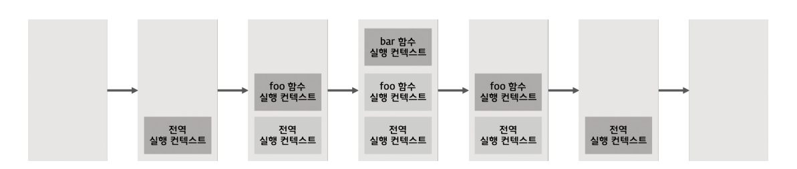

# 실행 컨텍스트

실행 컨텍스트는 자바스크립트의 동작 원리를 담고 있는 핵심 개념입니다. 실행 컨텍스트를 이해하게 되면, 자바스크립트가 스코프를 기반으로 식별자와 식별자에 바인딩된 값을 관리하는 방식, 호이스팅이 발생하는 이유, 클로저의 동작 방식, 태스크 큐와 함께 동작하는 이벤트 핸들러와 비동기 처리의 동작 방식을 이해할 수 있습니다.

## 소스코드의 타입

ECMAScript 사양은 소스코드를 4가지 타입으로 구분합니다. 4가지 타입의 소스코드는 실행 컨텍스트를 생성합니다.

| 소스코드의 타입 | 설명                                                                                                      |
| --------------- | --------------------------------------------------------------------------------------------------------- |
| 전역코드        | 전역에 존재하는 소스코드를 말한다. 전역에 정의된 함수, 클래스 등의 내부 코드는 포함되지 않는다.           |
| 함수 코드       | 함수 내부에 존재하는 소스코드를 말한다. 함수 내부에 중첩된 함수, 클래스 등의 내부 코드는 포함되지 않는다. |
| eval 코드       | 빌트인 전역 함수인 eval 함수에 인수로 전달되어 실행되는 소스코드를 말한다                                 |
| 모듈 코드       | 모듈 내부에 존재하는 소스코드를 말한다. 모듈 내부의 함수, 클래스 등의 내부 코드는 포함되지 않는다.        |

소스코드를 4가지 타입으로 구분하는 이유는 소스코드의 타입에 따라 실행 컨텍스트를 생성하는 과정과 관리 내용이 다르기 때문입니다.

1. 전역 코드

전역 코드는 전역 변수를 관리하기 위해 최상위 스코프인 전역 스코프를 생성해야 합니다.

var 키워드로 선언된 전역 변수와 함수 선언문으로 정의된 전역 함수를 전역 객체의 프로퍼티와 메서드로 바인딩하고 참조하기 위해 전역 객체와 연결되어야 합니다. 이를 위해 전역 코드가 평가되면 전역 실행 컨텍스트가 생성됩니다.

2. 함수 코드

함수 코드는 지역 스코프를 생성하고 지역 변수, 매개변수, arguments 객체를 관리해야 합니다. 그리고 생성한 지역 스코프를 전역 스코프에서 시작하는 스코프 체인의 일원으로 연결해야 합니다. 이를 위해 함수 코드가 평가되면 함수 실행 컨텍스트가 생성됩니다.

3. eval 코드

eval 코드는 strict mode 에서 자신만의 독자적인 스코프를 생성한다. 이를 위해 eval 코드가 평가되면 eval 실행 컨텍스트가 생성된다.

4. 모듈 코드

모듈 코드는 모듈별로 독립적인 모듈 스코프를 생성합니다. 이를 위해 모듈 코드가 평가되면 모듈 실행 컨텍스트가 생성됩니다.

## 소스코드의 평가와 실행

모든 소스코드는 실행에 앞서 평가 과정을 거치고, 코드를 실행하기 위한 준비를 합니다.

소스코드 평가 과정에서는 실행 컨텍스트를 생성하고 변수, 함수 등의 선언문만 먼저 실행하여 생성된 변수나 함수 식별자를 키로 실행 컨텍스트가 관리하는 스코프에 등록합니다.

평가 과정이 끝나면 비로소 선언문을 제외한 소스코드가 순차적으로 실행되기 시작합니다. 이때 필요한 정보, 변수나 함수의 참조를 실행 컨텍스트가 관리하는 스코프에서 검색헤서 취득합니다. 그리고 변수 값의 변경 등 소스코드의 실행 결과는 다시 실행 컨텍스트가 관리하는 스코프에 등록 됩니다.

```js
var x;
x = 1;
```

위 예제로 보자면, 자바스크립트 엔진은 소스코드 평가 과정에서 변수 선언문 `var x`를 먼저 실행합니다, 이 때 `x`는 실행 컨텍스트가 관리하는 스코프에 등록되고 `undefined`로 초기화 됩니다.

소스코드 평가 과정이 끝나면 비로소 소스코드 실행 과정이 시작되는데, `var x`는 소스코드 평가 과정에서 이미 실행이 완료되었기 때문에 할당문 `x = 1`만 실행됩니다.

## 실행 컨텍스트의 역할

```js
const x = 1;
const y = 2;

function foo(a) {
  const x = 10;
  const y = 20;

  console.log(a + x + y);
}

foo(100); // 130

console.log(x + y); // 3;
```

위 예시를 볼게요, 전역 코드와 함수 코드가 구성되어 있습니다.
자바스크립트 엔진이 이 예제를 어떻게 평가하고 실행을 하게될까요?

첫번째로 자바스크립트 엔진은 전역 코드 평가를 하게 됩니다.
전역 코드 평가 과정을 거치면서 코드를 실행할 준비를 하죠. 소스코드 평가 과정에서는 선언문만 먼저 실행이 되요.

두번째로 전역 코드를 실행합니다. 전역 코드 평가과정이 끝나면 런타임이 시작돼 전역 코드가 순차적으로 실행됩니다. 이때 전역 변수에 값이 할당되고, 함수가 호출됩니다. 함수가 호출된다면 실행하던 전역 코드의 실행을 일시 중단 후 코드 실행 순서를 변경하여 함수 내부로 진입해요.

세번째로 함수 코드를 평가합니다. 함수 호출에 의해 코드 실행 순서가 변경되어 함수 내부로 진입하면 함수 내부의 문들을 실행하기에 앞서 함수 코드 평가 과정을 거칩니다. 이때 매개변수와 지역 변수 선언문이 먼저 실행되고, 그 결과 생성된 매개변수와 지역 변수가 실행 컨텍스트가 관리하는 지역 스코프에 등록됩니다. 함수 내부에서 지역 변수처럼 사용할 수 있는 arguments 객체가 생성되어 지역 스코프에 등록되고 this 바인딩도 결정됩니다.

네번째로 함수 코드가 실행됩니다. 함수 코드 평가 과정이 끝나면 런타임이 시작되어 코드가 순차적으로 실행됩니다.

실행 컨텍스트는 소스코드를 실행하는 데 필요한 환경을 제공하고 코드의 실행 결과를 실제로 관리하는 영역입니다.

실행 컨텍스트는 식별자를 등록하고 관리하는 스코프와 코드 실행 순서 관리를 구현한 내부 메커니즘으로, 모든 코드는 실행 컨텍스트를 통해 실행되고 관리됩니다.

## 실행 컨텍스트 스택

```js
const x = 1;

function foo() {
  const y = 2;

  function bar() {
    const z = 3;
    console.log(x + y + z);
  }

  bar();
}

foo(); // 6
```

위 예시 코드를 볼게요, 위 예제는 소스코드 타입으로 분류할 때 전역 코드와 함수 코드로 이루어져 있습니다.

자바스크립트 엔진은 먼저 전역 코드를 평가하여 전역 실행 컨텍스트를 생성합니다.

이때 생성된 실행 컨택스트를 스택 자료구조로 관리되는데, 이를 실행 컨텍스트 스택이라고 부릅니다.

위 코드를 실행하게 되면 코드가 실행되는 시간의 흐름에 따라 실행 컨텍스트 스택에는 다음과 같이 실행 컨텍스트가 추가되고 제거됩니다.



맨 처음 전역 코드의 평가와 실행이 진행됩니다. 전역변수 x와 전역 변수 foo 는 전역 실행 컨텍스트에 등록됩니다. 이후 전역 코드가 실행되기 시작하여 전역 변수 x에 값이 할당되고 전역 함수 foo가 호출됩니다.

전역 함수 foo가 호출되면 전역 코드 실행이 중단되고 foo 함수의 코드 평가와 실행이 이루어지겠죠? 그럼 foo 함수 내에 있는 지역변수 y와 중첩 함수 bar 가 foo 함수 실핼 컨텍스트에 등록되고, foo 함수가 실행되며 지역 변수 y에 값이 할당되고 중첩 함수 bar 가 호출됩니다.

그 이후에 중첩 함수 bar가 호출되면 foo 함수 코드의 실행이 일시 중단되고 bar 함수의 평가와 실행이 이루어질겁니다. 그 안에 있는 지역변수 z가 bar 함수 실행 컨텍스트에 등록이 되고, 코드가 실행되어 지역 변수 z에 값이 할당되고 console.log 메서드를 호출한 후 bar 함수가 종료됩니다.

bar 함수가 종료되면 foo 함수로 복귀하게되는데 이 때 bar는 실행이 끝났기 때문에 스택에서 제거됩니다. 그리고 foo도 모두 실행됐다면 foo 함수 실행 컨텍스트도 스택에서 제거될거에요. 그리고 더 이상 실행할 전역 코드가 남아 있지 않다면 스택에서 전역 실행 컨텍스트도 제거될겁니다.

이처럼 실행 컨텍스트 스택은 코드의 실행 순서를 관리합니다. 소스코드가 평가되면 실행 컨텍스트가 생성되고 실행 컨텍스트 스택의 최상위에 쌓입니다. 실행 컨텍스트 스택의 최상위에 존재하는 실행 컨텍스트는 언제나 현재 실행 중인 코드의 실행 컨텍스트 입니다.

## 렉시컬 환경

렉시컬 환경은 식별자와 식별자에 바인딩된 값, 그리고 상위 스코프에 대한 참조를 기록하는 자료구조로 실행 컨텍스트를 구성하는 컴포넌트 입니다. 실행 컨텍스트 스택이 코드의 실행 순서를 관리한다면 렉시컬 환경은 스코프와 식별자를 관리합니다.

렉시컬 환경은 키와 값을 갖는 객체 형태의 스코프를 생성하여 식별자를 키로 등록하고 식별자에 바인딩된 값을 관리합니다.

즉, 렉시컬 환경은 스코프를 구분하여 식별자를 등록하고 관리하는 저장소 역할을 하는 렉시컬 스코프의 실체 입니다.

실행 컨텍스트는 LexicalEvironment 컴포넌트와 VariableEnvironment 컴포넌트로 구성되는데, 생성 초기에 두 컴포넌트는 하나의 동일한 렉시컬 환경을 참조합니다. 이후 몇 가지 상황을 만나면 VariableEnvironment 컴포넌트를 위한 새로운 렉시컬 환경을 생성, 이때부터 두 컴포넌트는 내용이 달라지는 경우도 있습니다.

렉시컬 환경은 EnvironmentRecord 와 OuterLexicalEnvironmentReference 로 구성이 되는데, 환경 레코드는 스코프에 포함된 식별자를 등록하고 등록된 식별자에 바인딩된 값을 관리하는 저장소 입니다.

외부 렉시컬 환경에 대한 참조는 상위 스코프를 가리키는데, 이때 상위 스코프란 외부 렉시컬 환경, 즉 해당 실행 컨텍스트를 생성한 소스코드를 포함하는 상위 코드의 렉시컬 환경을 말합니다.

## 실행 컨텍스트의 생성과 식별자 검색 과정

```js
var x = 1;
const y = 2;

function foo(a) {
  var x = 3;
  const y = 4;

  function bar(b) {
    const z = 5;
    console.log(a + b + x + y + z);
  }

  bar(10);
}

foo(20); // 42
```

위 예시코드를 보면서 실행 컨텍스트가 생성되고 코드 실행 결과가 어떻게 관리되는지 그리고 어떻게 실행 컨텍스트를 통해 식별자를 검색하는지 살펴볼게요.

첫번째로 전역 객체가 먼저 생성됩니다. 전역 객체는 전역 코드가 평가되기 이전에 생성돼요. 그 이후에 전역 코드가 평가됩니다.

소스코드가 로드되면 자바스크립트 엔진은 전역 코드를 평가합니다. 전역 코드 평가는 다음과 같은 순서로 진행이 되는데요

- 전역 실행 컨텍스트 생성
- 전역 렉시컬 환경 생성
  - 전역 환경 레코드 생성
    - 객체 환경 레코드 생성
    - 선언적 환경 레코드 생성
  - this 바인딩
  - 외부 렉시컬 환경에 대한 참조 결정

먼저 비어있는 전역 실행 컨텍스트를 생성해서 실행 컨텍스트 스택에 푸시를 합니다. 그 이후에 전역 레시컬 환경이 생성되어 전역 실행 컨텍스트에 바인딩이 됩니다.

전역 렉시컬 환경을 구성하는 컴포넌트인 전역 환경 레코드는 전역 변수를 관리하는 전역 스코프, 전역 객체의 빌트인 전역 프로퍼티와 빌트인 전역 함수, 표준 빌트인 객체를 제공하는데. 모든 전역 변수가 전역 객체의 프로퍼티가 되는 ES6 이전에는 전역 객체가 전역 환경 레코드의 역할을 수행했지만, es6 부터는 let, const로 선언한 전역 변수는 전역 객체의 프로퍼티가 되지 않고 개념적인 블록 내에 존재하게 됩니다.

이처럼 기존의 var 키워드로 선언한 전역 변수와 ES6의 let, const 키워드로 선언한 전역 변수를 구분하여 관리하기 위해 전역 스코프 역할을 하는 전역 환경 레코드는 객체 환경 레코드와 선언적 환경 레코드로 구성되어 있습니다.

객체 환경 레코드가 생성되면서, 전역 코드 평가 과정에서 var 키워드로 선언한 전역 변수와 함수 선언문으로 정의된 전역 함수는 전역 환경 레코드의 객체 환경 레코드에 연결돤 BindingObject를 통해 전역 객체의 프로퍼티와 메서드가 됩니다.

let, const 키워드로 선언한 전역 변수는 선언적 환경 레코드에 등록되고 관리합니다. 이 전역 변수는 전역 객체의 프로퍼티가 되지 않고 개념적인 블록 내에 존재한다고 계속 설명했었는데, 이 개념적인 블고이 바로 전역 환경 레코드의 선언적 환경 레코드 입니다.

그 이후 this 바인딩이 이루어지는데, 전역 환경 레코드의 [[GlobalThisValue]] 내부 슬롯에 this가 바인딩 됩니다. 일반적으로 전역 코드에서 this 는 전역 객체를 가리키므로 내부 슬롯에는 전역 객체가 바인딩 됩니다. 전역 코드에서 this를 참조하면 내부 슬롯에 바인딩되어 있는 객체가 반환됩니다.

외부 렉시컬 환경에 대한 참조는 현재 평가 중인 소스코드를 포함하는 외부 소스코드의 렉시컬 환경, 즉 상위 스코프를 가리킵니다. 이를 통해 단방향 링크드 리스트인 스코프 체인을 구현합니다.

이 후, 전역 코드가 실행되고 전역 변수 x,y 에 값이 할당되며 foo 함수가 호출이 됩니다. 이 때, 변수 할당문 또는 함수 호출문을 실행하려면 먼저 변수 또는 함수 이름이 선언된 식별자 인지를 확인해야 하는데, 선언되지 않은 식별자는 참조를 할 수 없기 때문에 할당이나 호출도 할 수 없기 때문이에요.

또한 식별자는 스코프가 다름녀 같은 이름을 가질 수 있습니다. 위 예시코드에서도 x,y 라는 전역변수와 foo 함수 내에 있는 x,y 는 이름이 같지만 오류가 발생하지 않습니다.

동일한 이름의 식별자가 다른 스코프에 여러 개 존재할 수 있기 때문에 어느 스코프의 식별자를 참조하면 되는지 결정을 해주어야하는데 이걸 식별자 결정이라고 해요.

식별자 결정을 위해 식별자를 검색할 때는 실행 중인 실행 컨텍스트에서 식별자를 검색하기 시작하여 상위 스코프로 이동하여 식별자를 검색하는 스코프 체인이 일어납니다.

x,y 의 전역변수에 값이 할당되고 foo 함수가 호출되었으면 이제 foo 함수를 평가해서 실행 컨텍스트를 생성하여 스택에 집어넣게 됩니다. 똑같이 함수 코드를 평가하면서, 함수 실행 컨텍스트를 생성하고 렉시컬 환경이 생성되면서 환경 레코드가 생성되고, this 바인딩 후 외부 렉시컬 환경에 대한 참조가 결정되게 돼요.

그 이후는 같습니다 . foo 안에 선언된 지역변수에 값을 할당하고 bar 함수를 만나면 위와 같은 형식으로 실행 컨텍스트가 생성, 렉시컬 환경 생성, 환경 레코드 생성, this 바인딩, 참조 결정이 이루어지겠죠?
